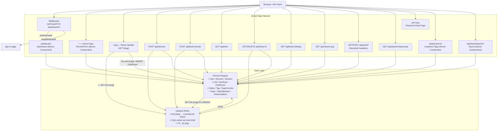

# shrtnr — URL Shortener

A production-grade, fully serverless URL shortener built with Next.js 15, Prisma Postgres, Upstash Redis, Auth.js (NextAuth v5), and shadcn/ui. Designed to be both a deployable product and a deep study resource for **system design interviews** — the URL shortener is the single most common system design question at top tech companies.

---

## Table of Contents

1. [Features](#features)
2. [Tech Stack](#tech-stack)
3. [Quick Start](#quick-start)
4. [Environment Variables](#environment-variables)
5. [GitHub OAuth Setup](#github-oauth-setup)
6. [Architecture Diagram](#architecture-diagram)
7. [API Reference](#api-reference)
8. [System Design Deep Dive](#system-design-deep-dive)
   - [Requirements Analysis](#requirements-analysis)
   - [The Critical Path: Redirect](#the-critical-path-redirect)
   - [ID / Slug Generation](#id--slug-generation)
   - [Caching Strategy](#caching-strategy)
   - [Authentication & Multi-tenancy](#authentication--multi-tenancy)
   - [Geographic Routing](#geographic-routing)
   - [Password-Protected Links](#password-protected-links)
   - [Database Design & Indexing](#database-design--indexing)
   - [Rate Limiting](#rate-limiting)
   - [Scalability & Sharding](#scalability--sharding)
   - [Analytics Pipeline](#analytics-pipeline)
   - [Load Balancing](#load-balancing)
9. [Interview Q&A](#interview-qa)
10. [Deployment (Vercel)](#deployment-vercel)
11. [Portfolio Value](#portfolio-value)

---

## Features

| Tier         | Feature                                        | Status |
|--------------|------------------------------------------------|--------|
| Basic        | Create short URLs                              | ✅     |
| Basic        | Redirect to original link                      | ✅     |
| Basic        | QR code generation + PNG download              | ✅     |
| Basic        | REST API                                       | ✅     |
| Intermediate | Click tracking (aggregate counter)             | ✅     |
| Intermediate | Per-click event log                            | ✅     |
| Intermediate | Analytics chart (7d / 30d)                     | ✅     |
| Intermediate | Country / device / browser / OS breakdown      | ✅     |
| Intermediate | Country heatmap (world map)                    | ✅     |
| Intermediate | Top referrers                                  | ✅     |
| Intermediate | Expiration dates                               | ✅     |
| Intermediate | Custom aliases + live availability             | ✅     |
| Intermediate | Bulk link creation via CSV                     | ✅     |
| Advanced     | User accounts (GitHub OAuth + email/password)  | ✅     |
| Advanced     | Per-user dashboard & link isolation            | ✅     |
| Advanced     | Password-protected links                       | ✅     |
| Advanced     | Geographic redirects per country               | ✅     |
| Advanced     | Rate limiting (sliding window)                 | ✅     |
| Advanced     | Redis read-through cache                       | ✅     |
| Advanced     | DB indexes for fast lookups                    | ✅     |
| SaaS         | Link folders (organize by project/category)    | ✅     |
| SaaS         | Link tags (multi-label, color-coded)           | ✅     |
| SaaS         | Link notes (internal annotation)              | ✅     |
| SaaS         | Archive / restore links                        | ✅     |
| SaaS         | Deactivate / reactivate links                  | ✅     |
| SaaS         | Pin links to top of dashboard                  | ✅     |
| SaaS         | Edit link (URL, slug, expiry, folder, tags)    | ✅     |
| SaaS         | Teams with role-based permissions              | ✅     |
| SaaS         | Team invitations via email token               | ✅     |

---

## Tech Stack

| Layer          | Technology                        | Why                                                       |
|----------------|-----------------------------------|-----------------------------------------------------------|
| Framework      | Next.js 15 App Router             | SSR, Server Actions, Route Handlers — one deployment      |
| Auth           | Auth.js (NextAuth v5)             | GitHub OAuth + credentials, JWT sessions, PrismaAdapter   |
| Database       | Prisma + Prisma Postgres          | Managed Postgres with built-in connection pooling         |
| Cache          | Upstash Redis                     | Serverless-compatible, edge-ready, free tier              |
| UI             | shadcn/ui + Tailwind CSS          | Accessible components, no runtime CSS-in-JS               |
| Charts         | Recharts                          | Composable, well-maintained React chart library           |
| Maps           | react-simple-maps                 | Lightweight SVG world map for country heatmap             |
| QR Codes       | qrcode.react                      | Client-side SVG generation + Canvas PNG export            |
| Password hash  | bcryptjs                          | Secure password storage (cost factor 12)                  |
| UA parsing     | Custom (`lib/ua-parser.ts`)       | Zero dependency, regex-based device/browser/OS detection  |
| CSV parsing    | papaparse                         | Robust client-side CSV → bulk link import                 |
| Font           | JetBrains Mono                    | Monospace font for a developer-friendly aesthetic         |
| Deployment     | Vercel                            | Automatic deployments, edge network, free SSL             |

---

## Quick Start

```bash
# 1. Clone and install
git clone https://github.com/your-username/shrtnr.git
cd shrtnr
npm install

# 2. Configure environment
cp .env.example .env.local
# Fill in all required variables (see below)

# 3. Push schema to database
npx prisma db push

# 4. Start dev server
npm run dev
```

Open [http://localhost:3000](http://localhost:3000).

---

## Environment Variables

| Variable                    | Required | Description                                                   |
|-----------------------------|----------|---------------------------------------------------------------|
| `DATABASE_URL`              | Yes      | Postgres connection string (`postgres://...@db.prisma.io/...`) |
| `UPSTASH_REDIS_REST_URL`    | Yes      | Upstash Redis REST endpoint                                   |
| `UPSTASH_REDIS_REST_TOKEN`  | Yes      | Upstash Redis REST token                                      |
| `AUTH_SECRET`               | Yes      | Random 32-char secret — `openssl rand -base64 32`             |
| `AUTH_GITHUB_ID`            | No*      | GitHub OAuth App Client ID                                    |
| `AUTH_GITHUB_SECRET`        | No*      | GitHub OAuth App Client Secret                                |
| `NEXT_PUBLIC_APP_URL`       | Yes      | Your deployment URL, no trailing slash                        |

*GitHub OAuth is optional — email/password sign-up works without it.

---

## GitHub OAuth Setup

1. Go to [github.com/settings/developers](https://github.com/settings/developers) → **New OAuth App**
2. Set **Homepage URL**: `http://localhost:3000` (or your production domain)
3. Set **Authorization callback URL**: `http://localhost:3000/api/auth/callback/github`
4. Copy **Client ID** → `AUTH_GITHUB_ID`
5. Generate **Client Secret** → `AUTH_GITHUB_SECRET`
6. For production, create a second OAuth App with your Vercel domain as the callback URL

---

## Architecture Diagram



### Data flow summary

| Path | Hot | Cold |
|------|-----|------|
| **Redirect** `GET /:slug` | Redis HIT → immediate 302 | Redis MISS → Postgres → cache → 302 |
| **Shorten** `POST /api/shorten` | — | Postgres INSERT → Redis SET |
| **Dashboard** | — | Postgres SELECT (user-scoped) |
| **Analytics** | — | Postgres GROUP BY day/country/device |
| **Rate limit** | Redis ZADD/ZCOUNT | — |

---

## API Reference

All REST endpoints return `application/json`. Authenticated endpoints require a valid session cookie (set via the web UI sign-in flow).

---

### `POST /api/shorten`

Create a short URL. Requires authentication.

**Rate limit:** 10 requests / minute / IP

**Request body:**
```json
{
  "url": "https://example.com/very/long/url",
  "slug": "my-link",
  "expiresAt": "2025-12-31T23:59:59Z",
  "password": "secret123",
  "geoRules": [
    { "country": "US", "url": "https://us.example.com" },
    { "country": "GB", "url": "https://uk.example.com" }
  ]
}
```

All fields except `url` are optional.

**Response `201`:**
```json
{
  "id": "clxyz123",
  "slug": "my-link",
  "shortUrl": "https://shrtnr.app/my-link",
  "url": "https://example.com/very/long/url",
  "expiresAt": "2025-12-31T23:59:59.000Z",
  "createdAt": "2025-01-15T10:00:00.000Z"
}
```

**Errors:** `400` missing url · `401` unauthenticated · `409` slug taken · `422` invalid url/slug · `429` rate limited

---

### `POST /api/bulk-shorten`

Create multiple links in one request (used by the CSV bulk upload UI).

**Rate limit:** 50 requests / minute / IP

**Request body:**
```json
{ "url": "https://example.com", "slug": "optional-alias" }
```

One call per link; the client batches them. Identical to `/api/shorten` without geo/password options.

**Response `201`:** Same as `/api/shorten`.

---

### `GET /api/links?page=1&limit=20`

List the authenticated user's links, paginated.

**Response `200`:**
```json
{
  "links": [
    {
      "id": "...",
      "slug": "abc1234",
      "shortUrl": "https://shrtnr.app/abc1234",
      "url": "https://example.com",
      "clicks": 42,
      "expiresAt": null,
      "hasPassword": false,
      "createdAt": "..."
    }
  ],
  "meta": { "total": 150, "page": 1, "limit": 20, "pages": 8 }
}
```

---

### `GET /api/links/:id`

Get a single link by ID. Must belong to the authenticated user.

---

### `DELETE /api/links/:id`

Delete a link and evict its Redis cache entry.

**Response `200`:** `{ "success": true }`

---

### `GET /api/links/:id/stats?days=30`

Get time-series and breakdown analytics. Must belong to authenticated user.

**Response `200`:**
```json
{
  "link": { "id": "...", "slug": "...", "clicks": 200 },
  "clicksByDay": [
    { "date": "2025-01-10", "clicks": 12 }
  ],
  "topReferers": [
    { "name": "twitter.com", "count": 50 },
    { "name": "Direct", "count": 30 }
  ],
  "topCountries": [
    { "name": "US", "count": 80 }
  ],
  "deviceStats": [
    { "name": "mobile", "count": 110 },
    { "name": "desktop", "count": 90 }
  ],
  "browserStats": [...],
  "osStats": [...],
  "totalInPeriod": 200,
  "days": 30
}
```

---

### `GET /api/check-slug?slug=my-link`

Check if a custom alias is available (used by live availability check in the UI).

**Response:** `{ "available": true }` or `{ "available": false, "reason": "taken" | "invalid" | "length" }`

---

### Auth endpoints (NextAuth v5)

| Method | Path | Description |
|--------|------|-------------|
| `GET`  | `/api/auth/session` | Get current session |
| `POST` | `/api/auth/signin/github` | Initiate GitHub OAuth |
| `POST` | `/api/auth/signin/credentials` | Sign in with email + password |
| `POST` | `/api/auth/signout` | Sign out |
| `GET`  | `/api/auth/callback/github` | GitHub OAuth callback |

---

### Redirect endpoint

| Method | Path | Description |
|--------|------|-------------|
| `GET`  | `/:slug` | Redirect to original URL (302) |
| `GET`  | `/pw/:slug` | Password gate page for protected links |
| `GET`  | `/api/team/invite/accept?token=...` | Accept a team invitation |

---

## System Design Deep Dive

This section covers the design decisions behind shrtnr and maps them to real-world scale. System design interviewers use URL shorteners precisely because they touch every hard problem: read-heavy workloads, distributed ID generation, caching, analytics, and user isolation.

---

### Requirements Analysis

**Functional requirements:**
- Create a short URL from a long URL (authenticated and anonymous API)
- Redirect `/:slug` to the original URL with low latency
- Track click analytics: count, time-series, country, device, browser, OS, referrer
- Optional features per link: custom alias, expiration, password protection, geo-redirect rules
- User accounts: each user sees only their own links
- Organize links into folders, apply tags, add internal notes
- Archive, deactivate, and pin links
- Collaborate via teams with role-based access (admin / editor / viewer)

**Non-functional requirements:**
- **High availability:** redirects succeed even if the database is slow/down (Redis serves the hot path)
- **Low latency:** target <50ms redirect globally
- **Durability:** no lost links (Postgres is source of truth, Redis is evictable cache)
- **Read-heavy:** ~100:1 read-to-write ratio (many redirects per shorten operation)
- **Data isolation:** user A cannot see or delete user B's links

**Capacity estimates** (back-of-envelope for 100M DAU):

| Metric | Calculation | Result |
|--------|-------------|--------|
| New links/day | 10M | ~115 writes/sec |
| Redirects/day | 1B | ~11,500 reads/sec |
| Storage (links) | 500B × 10M/day × 5yr | ~9 TB |
| Storage (events) | 200B × 1B/day × 5yr | ~365 TB |
| Bandwidth | 1B redirects × 1KB | ~1 TB/day |

---

### The Critical Path: Redirect

The redirect is the most latency-sensitive operation. Every optimization in this system targets this path.

```
GET /:slug
     │
     ▼
1. Redis GET "link:{slug}"                   ← ~0.5ms round-trip (Upstash)
   ├── HIT  (CachedLink JSON)
   │     ├── isActive = false?  → 302 /not-found
   │     ├── expiresAt < now?  → 302 /link-expired
   │     ├── hasPassword && no cookie?  → 302 /pw/:slug
   │     └── geoRules match x-vercel-ip-country?  → 302 geo URL
   │
   └── MISS
         ▼
   2. Prisma SELECT WHERE slug=? INCLUDE geoRules  ← ~5–20ms
         ├── NOT FOUND  → 302 /not-found
         └── FOUND
               ▼
         3. Redis SET "link:{slug}" <JSON> EX 2592000   ← cache for 30d
               ▼
         (same active / expiry / password / geo checks as HIT path)
     │
     ▼
4. fire-and-forget (non-blocking):
   ├── Prisma UPDATE Link SET clicks += 1
   └── Prisma INSERT ClickEvent { country, device, browser, os, referer }
     │
     ▼
5. HTTP 302 Location: <original_url or geo_url>
```

**Why 302 (temporary) not 301 (permanent)?**
301 is cached permanently by browsers — you lose click tracking entirely. 302 forces re-requests through your server. Premium tiers at real shorteners offer 301 for SEO value after the user opts out of tracking.

**Why fire-and-forget?**
Writing to Postgres on the critical path adds 10–50ms. The redirect user doesn't need to wait for analytics. If the write fails, one event is lost — acceptable. At scale, this becomes a message queue (Kafka/SQS) consumed by a stream processor.

**CachedLink structure** — the Redis value is a full JSON object, not just the URL string:

```typescript
type CachedLink = {
  id: string;
  url: string;
  expiresAt: string | null;
  hasPassword: boolean;
  isActive: boolean;
  geoRules: Array<{ country: string; url: string }>;
};
```

This means *all redirect decisions* are made from Redis alone on a cache hit — active check, expiry, password gate, and geo routing never touch the database.

---

### ID / Slug Generation

Generating unique, short, collision-resistant IDs is a canonical interview topic.

#### Option 1: Random nanoid (current implementation)

```typescript
import { nanoid } from "nanoid";
const slug = nanoid(7); // 7 chars from [A-Za-z0-9_-] = 64 possibilities each
```

- **Space:** 64^7 = 4.4 trillion combinations
- **Collision rate at 36.5B links (10M/day × 10yr):** ~0.8% → use 8–9 chars for production
- **Pros:** simple, no coordination needed, no enumeration risk
- **Cons:** must retry on collision (rare but possible)

#### Option 2: Base62 counter

Encode an incrementing integer in base62 (`[0-9A-Za-z]`).

```
counter = 1,000,000 → base62 = "4c92"
```

- **Pros:** no collisions, deterministic, short
- **Cons:** exposes volume (competitors enumerate links); requires atomic counter (`Redis INCR` or DB sequence with `SELECT FOR UPDATE`)

#### Option 3: Snowflake (distributed)

```
[timestamp 41-bit][machine-id 10-bit][sequence 12-bit]
```

- Globally unique, time-sortable, no coordination bottleneck at high scale
- Used by Twitter, Instagram, Discord
- Overkill under 10K writes/sec

#### Option 4: Hash of URL

```
slug = sha256(url).slice(0, 7)
```

- Same URL always produces the same short URL (natural deduplication)
- Hash collisions mean different URLs → same slug (rare but requires collision handling)

**Interview answer:** nanoid for simplicity, base62 counter for deduplication, Snowflake for multi-region >10K writes/sec.

---

### Caching Strategy

Redis is the difference between 1ms and 50ms redirects.

#### Read-through cache

```
Request → Redis HIT  → serve immediately (~1ms, zero DB load)
Request → Redis MISS → DB query → cache result → serve
```

**Key:** `link:{slug}`
**Value:** Full `CachedLink` JSON (id, url, expiresAt, hasPassword, isActive, geoRules)
**TTL:** 30 days — cold links evict naturally; hot links stay warm

#### Why store the full object, not just the URL?

Originally the cache stored only the URL string. This caused two problems:
1. Every redirect had to query Postgres to check `expiresAt` and `isActive`
2. Geo rules and password status required DB round-trips on every redirect

Storing the full `CachedLink` JSON means the hot path — which may include geo routing, active check, and password checks — never queries the database.

#### Cache invalidation

Four explicit invalidation events:
1. **Link deleted** → `redis.del("link:{slug}")`
2. **Link URL updated** → `redis.set(key, newValue)` (overwrite)
3. **Link deactivated** → `redis.del("link:{slug}")` (force re-fetch with updated `isActive`)
4. **Link expired** → evict in the redirect handler when expiry is detected

#### Eviction policy

Configure `maxmemory-policy = allkeys-lru` in production. Least-recently-used keys evict first. Top 20% of links (by Pareto: 80% of traffic) stay permanently warm. Target: >95% cache hit rate.

#### Cache stampede prevention

When a viral link's cache entry expires, thousands of concurrent requests may race to query the DB simultaneously — the "thundering herd" problem.

**Solution:** Redis lock pattern:
```typescript
const lock = await redis.set(`lock:${slug}`, "1", { nx: true, ex: 5 });
if (!lock) {
  // Wait briefly, then retry — the first requester will have re-populated cache
  await new Promise(r => setTimeout(r, 50));
  return redis.get(`link:${slug}`);
}
// Only one request reaches here — do the DB query and populate cache
```

Or: use stale-while-revalidate — return the expired cached value immediately and refresh in the background.

---

### Authentication & Multi-tenancy

Auth is implemented with **Auth.js (NextAuth v5)** using JWT sessions and the PrismaAdapter.

#### Two providers

1. **GitHub OAuth** — one-click sign-in, no password management
2. **Credentials** — email + bcrypt(password, 12) for users without GitHub

#### User isolation

Every `Link` has an optional `userId` FK. Server Actions and API handlers filter all queries by `session.user.id`:

```typescript
// links are always scoped to the authenticated user
const links = await prisma.link.findMany({
  where: { userId: session.user.id },
  orderBy: { createdAt: "desc" },
});
```

Anonymous links (created before auth was added, or via the public API without a session) have `userId = null` and are not shown in any dashboard.

#### Route protection

`middleware.ts` guards `/dashboard/*` before the request reaches any page:

```typescript
export default auth((req) => {
  if (!req.auth) {
    const url = req.nextUrl.clone();
    url.pathname = "/sign-in";
    url.searchParams.set("callbackUrl", req.nextUrl.pathname);
    return NextResponse.redirect(url);
  }
});
export const config = { matcher: ["/dashboard/:path*"] };
```

#### JWT token augmentation

NextAuth's default JWT doesn't include `user.id`. A callback injects it:

```typescript
callbacks: {
  jwt({ token, user }) {
    if (user?.id) token.id = user.id;
    return token;
  },
  session({ session, token }) {
    session.user.id = token.id as string;
    return session;
  },
}
```

---

### Teams & Role-Based Access

Links can belong to a team in addition to a user. Team membership is role-gated:

| Role    | Create links | Edit links | Delete links | Manage members |
|---------|-------------|------------|--------------|----------------|
| Admin   | ✅          | ✅         | ✅           | ✅             |
| Editor  | ✅          | ✅         | ❌           | ❌             |
| Viewer  | ❌          | ❌         | ❌           | ❌             |

Team invitations are token-based: the admin generates a signed token, emails it, and the recipient accepts via `GET /api/team/invite/accept?token=...`. The token is single-use and scoped to the invited email address.

---

### Geographic Routing

Each link can have an ordered list of `GeoRule` records: if the visitor's country matches a rule, they are redirected to that rule's URL instead of the default.

#### Data model

```prisma
model GeoRule {
  id      String @id @default(cuid())
  linkId  String
  country String  // ISO 3166-1 alpha-2 code: "US", "DE", "JP"
  url     String
  link    Link   @relation(...)
  @@unique([linkId, country])
}
```

#### Country detection (zero cost)

On Vercel, every request includes the `x-vercel-ip-country` header — a free, accurate, edge-injected country code. No MaxMind license or IP database required.

```typescript
const country = req.headers.get("x-vercel-ip-country") ?? "";
const geoMatch = cached.geoRules.find((r) => r.country === country);
if (geoMatch) return NextResponse.redirect(geoMatch.url, { status: 302 });
```

The geo rules are stored in the Redis `CachedLink` JSON, so geo-routing decisions require zero additional I/O.

#### Use cases

- Route US visitors to a US-specific landing page
- Show localized content without complex i18n routing
- Compliance: redirect EU visitors to GDPR-compliant version of a page

---

### Password-Protected Links

Links can have an optional `passwordHash` (bcrypt, cost factor 12). The protection flow:

```
GET /:slug
     │
     ├── hasPassword = true
     │         │
     │    Cookie "pw_{slug}" present?
     │         ├── YES, valid → proceed to redirect
     │         └── NO        → 302 /pw/:slug (password gate page)
     │
     └── hasPassword = false → proceed normally
```

`/pw/:slug` renders a form. On submission, the Server Action:
1. Fetches the link's `passwordHash` from Postgres
2. `bcrypt.compare(submitted, hash)`
3. On success: sets `httpOnly` cookie `pw_{slug}=1; SameSite=Strict; Path=/`
4. Client redirects to `/:slug`, which now reads the cookie and bypasses the gate

**Security properties:**
- `httpOnly` — not accessible to JavaScript
- `SameSite=Strict` — CSRF protection
- Cookie is slug-scoped, not global — accessing a different protected link requires its own password
- The hash is stored in Postgres, never in Redis, never sent to the client

---

### Database Design & Indexing

```sql
-- Auth tables (managed by PrismaAdapter)
User, Account, Session, VerificationToken

-- Link management
CREATE TABLE "Link" (
  id           TEXT PRIMARY KEY,
  slug         TEXT UNIQUE NOT NULL,
  url          TEXT NOT NULL,
  clicks       INTEGER DEFAULT 0,
  expires_at   TIMESTAMPTZ,
  password_hash TEXT,
  is_active    BOOLEAN DEFAULT true,
  is_archived  BOOLEAN DEFAULT false,
  is_pinned    BOOLEAN DEFAULT false,
  notes        TEXT,
  user_id      TEXT REFERENCES "User"(id) ON DELETE SET NULL,
  folder_id    TEXT REFERENCES "Folder"(id) ON DELETE SET NULL,
  team_id      TEXT REFERENCES "Team"(id) ON DELETE SET NULL,
  created_at   TIMESTAMPTZ DEFAULT now(),
  updated_at   TIMESTAMPTZ DEFAULT now()
);
CREATE INDEX idx_link_slug     ON "Link"(slug);
CREATE INDEX idx_link_user_id  ON "Link"(user_id);
CREATE INDEX idx_link_created  ON "Link"(created_at);

-- Organization
CREATE TABLE "Folder" (id, name, color, user_id, created_at);
CREATE TABLE "Tag" (id, name, color, user_id, created_at);
CREATE TABLE "TagsOnLinks" (link_id, tag_id, PRIMARY KEY (link_id, tag_id));

-- Teams
CREATE TABLE "Team" (id, name, created_at);
CREATE TABLE "TeamMember" (id, team_id, user_id, role ENUM('admin','editor','viewer'), joined_at);
CREATE TABLE "TeamInvitation" (id, team_id, email, role, token UNIQUE, accepted_at, expires_at, created_at);

-- Analytics
CREATE TABLE "GeoRule" (id, link_id, country, url, UNIQUE (link_id, country));
CREATE TABLE "ClickEvent" (id, link_id, referer, country, device, browser, os, created_at);
CREATE INDEX idx_click_link             ON "ClickEvent"(link_id);
CREATE INDEX idx_click_link_created_at  ON "ClickEvent"(link_id, created_at);
```

**Index decisions:**
- `slug` — O(log N) redirect lookup. Without this index, every redirect is an O(N) full table scan. This is the single most important index in the system.
- `(link_id, created_at)` — covers the most common analytics query pattern: "clicks for link X in the last 30 days" with a single range scan on the composite index.
- `user_id` — dashboard list queries: "all links for user Y" without a full scan.

**Why keep `Link.clicks` as a denormalized counter?**
`SELECT COUNT(*) FROM ClickEvent WHERE link_id = ?` scans potentially millions of rows per link. A pre-computed `clicks` integer updated with `UPDATE Link SET clicks = clicks + 1` is O(1) and never slows down.

---

### Rate Limiting

**Implementation: sliding window counter (Redis sorted sets)**

```typescript
const key = `rl:${ip}`;
const now = Date.now();
const windowMs = 60_000;

// Pipeline: atomic multi-command
await redis
  .pipeline()
  .zremrangebyscore(key, 0, now - windowMs)   // evict expired entries
  .zadd(key, { score: now, member: `${now}-${Math.random()}` })
  .zcount(key, now - windowMs, "+inf")         // count in window
  .expire(key, 60)                             // auto-cleanup
  .exec();

if (count > limit) return { success: false }; // 429
```

**Why sliding window over fixed window?**

Fixed window allows up to 2× the rate at boundaries. If the limit is 10/min and a window resets at :00, a user can fire 10 at :59 and 10 at :00 = 20 requests in ~1 second. Sliding window tracks the true rate in any rolling N-second period.

**Rate limit tiers:**

| Endpoint | Limit | Window |
|----------|-------|--------|
| `POST /api/shorten` | 10 | 1 minute |
| `POST /api/bulk-shorten` | 50 | 1 minute |
| Web form (Server Action) | 10 | 1 minute |

**At scale:** push rate limiting to the edge (Vercel Edge Middleware, Cloudflare Workers) to reject requests before they reach origin servers. Redis still maintains the shared counter; edge workers query it via REST.

---

### Scalability & Sharding

#### Current capacity (single Postgres instance)

With indexes and Redis caching:
- ~10,000 reads/sec (most served from Redis, DB rarely queried)
- ~1,000 writes/sec (link creation, click increments)

#### Vertical → Read replicas → Sharding

```
Phase 1: Scale up DB instance (more RAM = larger buffer pool)
Phase 2: Read replicas for analytics; writes → primary
Phase 3: Horizontal sharding by hash(slug) % N
```

```
Writes              → Primary DB
Reads (analytics)   → Read Replica 1, 2...
Reads (redirects)   → Redis → Primary DB (fallback only)
```

#### Sharding by `slug` not `user_id`

The redirect handler knows the slug — not the user. Sharding by `user_id` would require a two-step lookup: find user → find shard. Sharding by `slug` means the redirect handler immediately knows which shard to query.

**Tradeoff:** analytics across all of a user's links requires scatter-gather across all shards. This is acceptable because analytics is latency-tolerant; redirects are not.

#### Alternative: distributed KV store

At Bitly scale (6B+ redirects/month), replace Postgres in the redirect path with a purpose-built KV store:
- **DynamoDB** — managed, auto-scaling, single-digit millisecond reads
- **Cassandra** — high write throughput, excellent for append-heavy click events
- Keep Postgres for metadata, user management, complex analytics

---

### Analytics Pipeline

Current implementation writes one `ClickEvent` row per redirect. Works well to ~100M events.

**Scaling analytics independently of the redirect path:**

```
GET /:slug
     │
     ├── 302 (immediate)
     │
     └── fire-and-forget → Kafka / SQS topic
                                │
                      ┌─────────▼──────────┐
                      │  Stream processor  │
                      │  (Flink / Spark)   │
                      └─────────┬──────────┘
                                │
            ┌───────────────────┼───────────────────┐
            ▼                   ▼                   ▼
     Redis counters        ClickHouse          Cold storage
     (real-time INCR)    (analytics DB)       (S3/Glacier)
     per slug + country   time-series          raw events
```

**Pre-aggregated tables** (maintained by stream processor):

```sql
CREATE TABLE click_daily (
  link_id  TEXT,
  date     DATE,
  country  TEXT,
  device   TEXT,
  clicks   INTEGER,
  PRIMARY KEY (link_id, date, country, device)
);
```

Dashboard queries hit this small, indexed table (one row per link per day per dimension) instead of billions of raw events. A query that scans 36.5B raw events becomes a query on 365 × num_links rows.

**Current UA parsing** is done in `lib/ua-parser.ts` — a lightweight regex-based parser with zero external dependencies that detects device type (mobile/tablet/desktop), browser, and OS from the User-Agent header.

---

### Load Balancing

Vercel handles this automatically for serverless deployments. Understanding the underlying mechanics:

**Layer 4 (TCP) vs Layer 7 (HTTP):**
- Layer 7 is standard for web apps — routes based on HTTP headers, URL path, cookies
- Vercel's edge network does Layer 7, routing to the nearest region

**Strategies:**

| Strategy | When to use |
|----------|-------------|
| Round-robin | Homogeneous servers, simple |
| Least connections | Better for long-lived connections |
| IP hash | Sticky sessions (not needed — we're stateless) |
| Weighted | Gradual traffic shifts (canary deploys) |

**Stateless by design:**
shrtnr has no in-process session state — all state lives in Redis or Postgres. Any server handles any request, making horizontal scaling trivial. This is intentional: stateful architectures (in-memory sessions, local caches) are one of the most common reasons applications fail to scale horizontally.

---

## Interview Q&A

**Q: How do you ensure slug uniqueness?**

A: The `slug` column has a `UNIQUE` constraint enforced by Postgres. For random slugs, we generate a 7-char nanoid and rely on the DB constraint — on collision (1-in-billions), we retry. For high-throughput writes, pre-generate a pool of slugs and `SPOP` from a Redis set atomically.

---

**Q: How would you scale to 100K redirects per second?**

A: The redirect path already only touches Redis (O(1), ~1ms). To hit 100K/sec:
1. Redis Cluster — shard the cache across multiple nodes
2. Deploy globally (Vercel regions or edge workers) — move execution near users
3. CDN-cache the 302 response for the top 1K slugs — intercept at the CDN layer
4. Move click tracking to async queue — never block the 302 for a DB write

---

**Q: A link goes viral — how do you handle the thundering herd?**

A: When a cold (uncached) link suddenly receives thousands of concurrent requests, all miss the cache simultaneously and hammer the DB. Prevention: Redis `SET lock:{slug} 1 NX EX 5` — only the first request queries the DB, others either wait (50ms) or serve a slightly stale value via stale-while-revalidate.

---

**Q: How do you prevent shortening malicious URLs?**

A: Multi-layer:
1. **Google Safe Browsing API** — check URL before saving
2. **Domain blocklist** — Redis set of known-bad domains (`SISMEMBER`)
3. **Rate limiting + auth** — require login to shorten (already implemented)
4. **Reporting** — let users flag links; auto-disable after N reports
5. **Link preview page** — show destination before redirecting (anti-phishing UX)

---

**Q: How do custom aliases avoid conflicting with `/dashboard`, `/api`?**

A: Next.js App Router static routes take priority over `[slug]` dynamic routes — `/dashboard` is always handled by `app/dashboard/page.tsx`. Additionally, a `RESERVED_SLUGS` blocklist in the shortening action prevents creating aliases that shadow system routes:

```typescript
const RESERVED = new Set(["dashboard", "api", "pw", "sign-in", "sign-up", "not-found", "link-expired"]);
if (RESERVED.has(slug)) return { success: false, error: "Reserved alias" };
```

---

**Q: How does geographic routing work without a paid GeoIP service?**

A: Vercel injects `x-vercel-ip-country` (ISO 3166-1 alpha-2) into every request header at the edge — free, accurate, zero latency overhead. The matched geo rule URL is stored directly in the Redis `CachedLink` JSON, so country-based routing decisions never require a database query.

---

**Q: How are password-protected links secured?**

A: The password is hashed with bcrypt (cost factor 12) and stored in Postgres — never in Redis, never in cookies. Verification sets an `httpOnly; SameSite=Strict` cookie scoped to the specific slug. The cookie value is `1` (a presence flag), not the password or hash — there's nothing to reverse.

---

**Q: How does the dashboard avoid stale data when switching filters (All Links / Archived / Folders)?**

A: `LinksTable` is a client component that stores links in React state with `useState(initialLinks)`. React only uses the initial value once — navigating between `/dashboard` and `/dashboard?archived=1` sends new props but doesn't reset state. The fix: a `key` prop on `LinksTable` derived from the active filter combination forces React to unmount and remount the component, reinitializing state with the correct server-fetched data.

---

**Q: How do you implement role-based access for teams?**

A: Each `TeamMember` record has a `role` enum (admin/editor/viewer). Server Actions check the caller's role before mutating data. The check pattern:

```typescript
const member = await prisma.teamMember.findFirst({
  where: { teamId, userId: session.user.id }
});
if (!member || member.role === "viewer") return { success: false, error: "Insufficient permissions" };
```

Roles are enforced server-side — the UI hides controls for insufficient roles, but the server always re-validates.

---

## Deployment (Vercel)

```bash
# 1. Push to GitHub
git push origin main

# 2. Import at vercel.com/new

# 3. Add environment variables in Vercel dashboard:
#    DATABASE_URL=postgres://...@db.prisma.io/...
#    UPSTASH_REDIS_REST_URL=https://...
#    UPSTASH_REDIS_REST_TOKEN=...
#    AUTH_SECRET=<run: openssl rand -base64 32>
#    AUTH_GITHUB_ID=<from GitHub OAuth App>
#    AUTH_GITHUB_SECRET=<from GitHub OAuth App>
#    NEXT_PUBLIC_APP_URL=https://your-domain.vercel.app

# 4. Run schema migration before first deploy
DATABASE_URL="postgres://..." npx prisma db push
```

**Custom domain:**
1. Vercel → Project → Settings → Domains → add domain
2. Update `NEXT_PUBLIC_APP_URL` to your domain
3. Update GitHub OAuth App callback URL to `https://your-domain.com/api/auth/callback/github`
4. SSL provisioned automatically via Let's Encrypt

---

## Portfolio Value

What makes this project impressive to hiring managers and interviewers:

### What's implemented (and why it matters)

| Decision | What it demonstrates |
|----------|---------------------|
| Redis CachedLink JSON with `isActive` flag | You think about all redirect decisions being made from cache, not just URL lookup |
| Fire-and-forget click tracking | You understand latency tradeoffs and async patterns |
| Sliding window rate limiting | You know the difference between fixed and sliding windows and why it matters |
| `(link_id, created_at)` composite index | You understand query patterns and how indexes serve them |
| JWT session with `user.id` injection | You understand auth token augmentation and type safety |
| Middleware-based route protection | You know where to apply auth guards in Next.js architecture |
| `hasPassword` flag in Redis (not just `passwordHash`) | You avoid unnecessary DB round-trips by encoding auth state in cache |
| Geo rules in Redis CachedLink | You think about data locality and avoid N+1 cache misses |
| bcrypt cost factor 12 | You understand the tradeoff between security and server load |
| `key` prop on LinksTable for filter changes | You understand React's reconciliation model and state initialization pitfalls |
| Teams with server-side role enforcement | You know that client-side permission hiding is not security |
| Folder/tag organization with optimistic UI | You understand UX patterns for fast perceived performance |

### Scalability discussion points (for interviews)

1. **The redirect hot path** is already designed to be horizontally scalable — stateless, cache-first, non-blocking analytics
2. **Analytics can scale independently** — the current Postgres `ClickEvent` table is trivially replaceable with ClickHouse or BigQuery without touching the redirect path
3. **Auth is isolated** — the user system is a separate concern from the redirect system; one can scale independently of the other
4. **Connection pooling** — Prisma Postgres includes a built-in connection pooler, solving the serverless cold-start connection exhaustion problem
5. **Teams as multi-tenancy** — the `teamId` FK on `Link` is the foundation for workspace-level isolation, a pattern used by every B2B SaaS product

### Honest limitations (shows engineering maturity)

- `Link.clicks` counter has a race condition under high concurrent load (use Redis `INCR` + batch-write for correctness at scale)
- Per-click DB write is still on the critical path today — a production system would queue this
- Team invitation emails are token links, not SMTP-sent — a production system integrates Resend or SendGrid
- No A/B testing, webhook support, or UTM builder (natural next features)
- Single-region — multi-region requires distributed ID generation (Snowflake) and replication strategy
